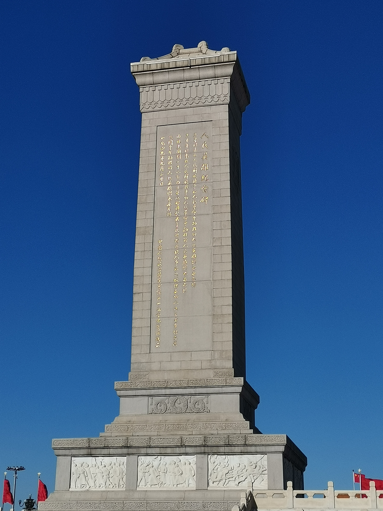

# 毛选读后感

这部书看的断断续续，今天大体给它翻完了。因为时间跨度比较久，我已经不确定当时打算看这本书的缘由。可能是这些原因互相叠加的缘故吧：（1）看马督公的一期期视频后，我可能逐渐意识到自己有“[思想](https://zh.wikipedia.org/wiki/%E6%80%9D%E6%83%B3)”这个玩意，所以开始尝试留意这方面的内容。（2）当时“流行”看“青年大学习”，但是同学和团委之间互相糊弄。糊弄的表现之一，刷新下视频，好有个记录方便截图，以达到完成任务的目的。既然这个过程有问题，但为什么周围没有人去尝试解决这个问题呢。

我们这代人，基本都经历过九年义务教育，对近现代史有个的了解。但这个历史知识基础，看《毛选》是不够的。《毛选》是咱们毛主席对那个年代所发生事情而写的一篇篇文章。历史储备不够，自然不知道为什么会有这一篇篇文章。

但是，我们有义务教育打底之后，走马观花的看《毛选》是没问题的。至于其中文章的结构，或者说分析事情的角度或者方法，理工科毕业的大学生，即使不看这本书也应该完全掌握。因为，平时学习的本科专业内容，必然会看到整体/局部，正面/反面，过去/现在等这样的分析方法。

从好奇的角度，我不推荐以看这本书为目的的看这本书。我推荐，因为好奇而阅读其中的某几篇文章，比如《湖南农民运动考察报告》。或者，我推荐，以该书为线索，去感兴趣得了解文章背后的历史。

下面我们可以尝试唤醒下，那个“死去”的初中历史内容。线索来源：[关于建国以来党的若干历史问题的决议-中华人民共和国人民政府网](https://www.gov.cn/test/2008-06/23/content_1024934.htm)

1. [辛亥革命 - 维基百科，自由的百科全书](https://zh.wikipedia.org/wiki/%E8%BE%9B%E4%BA%A5%E9%9D%A9%E5%91%BD)。
    1. 描述：辛亥革命是指始于1911年（辛亥年）武昌起义爆发，止于清宣统帝退位的革命。
    2. 意义：推翻了清朝的统治，结束了中国两千多年的封建帝制，建立了中华民国和临时革命政府。辛亥革命以后，谁要再想做皇帝，就做不成了。
2. ....
3. [新青年 - 维基百科，自由的百科全书](https://zh.wikipedia.org/wiki/%E6%96%B0%E9%9D%92%E5%B9%B4)。
    1. 描述：该刊创始人陈独秀在辛亥革命失败后对中国时局进行了思考，认为政治革命无用，而“救中国、建共和，首先得进行思想革命”。民国四年（1915年）夏天陈独秀从日本回上海后便开始筹备《青年杂志》。
    2. 相关内容：鲁迅没说过但做过的，学医救不了中国人。
4. [五四运动 - 维基百科，自由的百科全书](https://zh.wikipedia.org/wiki/%E4%BA%94%E5%9B%9B%E8%BF%90%E5%8A%A8)。
    1. 描述：五四运动是中国近代史上的一次学生运动。1919年5月4日，北京的学生游行示威，抗议巴黎和会上有关山东问题的决议，敦促当时的北洋政府不可签约，要求惩处相关官员。事情的缘由是，中国作为第一次世界大战的战胜国，本期望“公理战胜强权”，能收回战败国德国在山东的权益，但参会各国决定把权益转让给日本，中国民众很长一段时间以来积蓄的民族情绪爆发，学生高喊“外争主权，内除国贼”，上街游行，并发展到火烧赵家楼、痛打章宗祥。“五四运动”这个概念一般还包括5月4日后一系列的全国性游行示威、罢课、罢市、罢工等事件。
5. [国民革命军北伐 - 维基百科，自由的百科全书](https://zh.wikipedia.org/wiki/%E5%9C%8B%E6%B0%91%E9%9D%A9%E5%91%BD%E8%BB%8D%E5%8C%97%E4%BC%90)。
    1. 描述：1926年至1928年间，中国国民党领导的国民革命军向北洋军阀发动之内战。国民政府在北伐战争中，除了透过直属的国民革命军，也吸收中国各地反北洋势力，成功将北洋军阀及其掌控的北洋政府瓦解。北伐结束后，国民政府完成形式上的中国统一。
6. [四一二事件 - 维基百科，自由的百科全书](https://zh.wikipedia.org/wiki/%E5%9B%9B%E4%B8%80%E4%BA%8C%E4%BA%8B%E4%BB%B6)。
    1. 描述：是中国国民党“清党”第一期中的标志性事件。1927年4月12日，蒋介石领导中国国民党右派党员，在上海青帮的帮助下，解除工人纠察队武装。此后大规模逮捕、处决中国共产党党员和部分国民党左派。
    2. 相关内容：第一个国共合作失败、陈独秀右倾投降主义
7. [南昌起义 - 维基百科，自由的百科全书](https://zh.wikipedia.org/wiki/%E5%8D%97%E6%98%8C%E8%B5%B7%E7%BE%A9)。
    1. 描述：是中国共产党领导，以国民党左派即中国国民党革命委员会名义于1927年8月1日针对中国国民党在江西南昌发动的武装起事事件。南昌起义被视为第一次国共内战的开始，也是中国共产党及其直辖与间接管辖的武装力量事实上退出北伐战争的时点。
8. [八七会议 - 维基百科，自由的百科全书](https://zh.wikipedia.org/wiki/%E5%85%AB%E4%B8%83%E4%BC%9A%E8%AE%AE)。
    1. 描述：1927年8月7日，中共中央在汉口召开紧急会议。会议批判陈独秀右倾投降主义，总结大革命失败经验教训，确定土地革命和武装反抗中国国民党之总方针。
9. [秋收起义 - 维基百科，自由的百科全书](https://zh.wikipedia.org/wiki/%E7%A7%8B%E6%94%B6%E8%B5%B7%E4%B9%89)。
    1. 描述：是一个涉及四省的一连串的暴动。
    2. 结果之一：1927年9月19日，起义军余部在文家市汇合，毛泽东说服大家放弃师长余洒度进攻长沙计划，主张“向江西萍乡退却”。毛泽东已计划好了这支部队的目的地：南去一百七十公里的井冈山，指挥官们都不同意进山，但最后勉强服从了毛泽东，因为毛泽东是唯一在场的党代表。
    3. 结果之二：途中在江西萍乡确定向井冈山进发，1927年9月29日，抵达江西省永新县三湾村，在“泰和祥”杂货铺召开中共前敌委员会扩大会议，原本5,000多人的队伍，这时只剩下不足千人。三湾改编确立了“党指挥枪”、“党支部建在连上”、“官兵平等”等一整套崭新的治军方略。部队由一个师缩编为一个团，称工农革命军第一军第一师第一团，下辖两个营，共有700多支枪，毛泽东决定，在各级部队分别建立党的组织：班、排建立党小组，连队建立党支部，营、团建立党的委员会；连以上各级设党代表，由同级党组织的书记担任；全军由党的前敌委员会统一领导。
10. [井冈山革命根据地 - 维基百科，自由的百科全书](https://zh.wikipedia.org/wiki/%E4%BA%95%E5%86%88%E5%B1%B1%E9%9D%A9%E5%91%BD%E6%A0%B9%E6%8D%AE%E5%9C%B0)。
    1. 描述：井冈山革命根据地是中国共产党1927年在湖南、江西两省边界罗霄山脉中段创建的一个农村革命根据地。它是根据毛泽东“农村包围城市、武装夺取政权”理论创建的第一个农村革命根据地。
    2. 结果之一：1929年，朱德、毛泽东率红军主力离开井冈山。
    3. 相关内容一：井冈山的冬天异常寒冷，为了解决部队的冬衣、粮食和拓宽根据地的面积，1928年1月4日，毛泽东率领两个营的兵力占领遂川县城。部队分散活动，出现了有的战士借了老百姓的门板和稻草没有主动归还，在借来的许多同样的门板中，又往往弄错户主，睡过的地方也没打扫干净等。毛泽东于1928年1月25日在遂川县城李家坪召开了工农革命军全体指战员大会，宣布了“六项注意”：“上门板；捆铺草；说话和气；买卖公平；不拉夫，请来夫子要给钱；不打人骂人”。
    4. 相关内容二：[农村包围城市 - 维基百科，自由的百科全书](https://zh.wikipedia.org/wiki/%E5%86%9C%E6%9D%91%E5%8C%85%E5%9B%B4%E5%9F%8E%E5%B8%82)， 推荐阅读下：[中国的红色政权为什么能够存在？（一九二八年十月五日）](https://www.marxists.org/chinese/maozedong/marxist.org-chinese-mao-19281005.htm)
11. [中央革命根据地 - 维基百科，自由的百科全书](https://zh.wikipedia.org/wiki/%E4%B8%AD%E5%A4%AE%E9%9D%A9%E5%91%BD%E6%A0%B9%E6%8D%AE%E5%9C%B0)。
    1. 描述：中央苏区的历史可以追溯到1927年国民革命军北伐中中共与国民政府决裂后赣南、闽西两地共产党领导的农民武装斗争。随着1929年毛泽东、朱德所率武装和1930年彭德怀所率武装转战赣南、闽西地区，该地的“苏维埃运动”迅速发展，苏区面积不断扩大。1931年9月，在成功防御了国民革命军第三次围剿后，赣南、闽西两地的革命根据地连成了一片；11月，中华苏维埃共和国成立，中央苏区正式形成。
12. [九一八事变 - 维基百科，自由的百科全书](https://zh.wikipedia.org/wiki/%E4%B9%9D%E4%B8%80%E5%85%AB%E4%BA%8B%E8%AE%8A)
    1. 描述：九一八事变指1931年9月18日在中国东北发生的日本侵略战争，是日本1931年侵略中国东北的开端。驻沈阳东北军多次向正在北平的东北军领袖张学良报告遭到日军袭击，张学良亲自多次对东北军部将领下令“不抵抗”与“不正面冲突”。当时蒋命令东北军张学良部“绝对不得抵抗”，并撤至山海关内。9月19日，日军占领沈阳，接着分兵侵占辽宁其他地区及吉林省、黑龙江省，至1932年2月占领东北全境。
13. [中央苏区第五次反围剿战争 - 维基百科，自由的百科全书](https://zh.wikipedia.org/wiki/%E4%B8%AD%E5%A4%AE%E8%8B%8F%E5%8C%BA%E7%AC%AC%E4%BA%94%E6%AC%A1%E5%8F%8D%E5%9B%B4%E5%89%BF%E6%88%98%E4%BA%89)。
    1. 描述：从1933年10月17日，中华民国国民政府动员近100万国军，开始攻打中国共产党控制下的各个农村根据地，并以50万兵力重点进攻中央苏区。围剿历时363天，直到1934年10月14日才结束；红军被迫撤退，离开中央苏区根据地，标志着国民革命军第五次围剿的胜利。
    2. 相关内容：博古、李德等人提出御敌于国门之外的方针，企图以阵地战、正规战在苏区外御敌，保守苏区每一寸土地；命令由红三军团、红19师为主组成的东方军和由红一军团、红14师为主组成的中央红军，继续在闽西北地区和抚河与赣江之间地区对国军不停的进攻。但缺乏自动武器、严重缺乏重火力的红军在国军的高大的垒楼、深长壕沟的野战防御工事前遭受惨重损失。由于中共中央的军事战略和作战原则错误，这次作战红军始终处于被动，以致红军损失惨重，丧失大部中央苏区。
    3. 结果：第一方面军不得不进行二万五千里长征而转战到陕北，同在那里坚持斗争的陕北红军和先期到达的红二十五军相会合。第二、第四方面军也先后经过长征转战到陕北。红军主力撤离后的一些南方根据地，坚持了艰苦的游击战争。王明左倾错误造成的失败使革命根据地和白区的革命力量都受到极大损失，红军从三十万人减到三万人左右，共产党员从三十万人减到四万人左右。
14. [遵义会议 - 维基百科，自由的百科全书](https://zh.wikipedia.org/wiki/%E9%81%B5%E4%B9%89%E4%BC%9A%E8%AE%AE)。
    1. 描述：1935年1月15日至17日，红一方面军长征途中占领了贵州省遵义，于是顺道于当地举行会议。
    2. 意义：遵义会议解决了红军当时最紧迫的军事问题，对第五次反围剿战争的失败进行了总结，初步确立了毛泽东在军事上的领导地位。但是组织上仍保留了亲共产国际的势力，废黜了博古的总书记职务，以洛甫负总责（中共中央从1935年1月到1945年6月没有选举总书记或主席，有时为了工作方便对外称洛甫为总书记到1937年）。是中国共产党历史上一个生死攸关的转折点。用后来的话说，就是“在极端危急的关头，挽救了红军，挽救了党，挽救了中国革命”。
15. [长征 - 维基百科，自由的百科全书](https://zh.wikipedia.org/wiki/%E9%95%BF%E5%BE%81)
    1. 描述：长征，是1934年10月至1936年10月期间（抗日战争全面爆发前），中国共产党领导的中国工农红军红一方面军（“中央红军”）、红二方面军、红四方面军和红二十五军从中央苏区和南方苏区开始的战略转移，其最终抵达、汇聚于陕甘苏区。
16. [西安事变 - 维基百科，自由的百科全书](https://zh.wikipedia.org/wiki/%E8%A5%BF%E5%AE%89%E4%BA%8B%E5%8F%98)。
    1. 描述：西安事变是第一次国共内战末期的一场军事政变。1936年12月12日，时任西北剿匪总司令部副总司令的东北军将领张学良、时任国民革命军第十七路军总指挥的西北军将领杨虎城在西安发动“兵谏”，扣押国民政府军事委员会委员长兼行政院院长蒋介石，要求蒋介石立即抗日，停止“剿共”。
    2. 相关内容：第二次国共合作。
17. [七七事变 - 维基百科，自由的百科全书](https://zh.wikipedia.org/wiki/%E4%B8%83%E4%B8%83%E4%BA%8B%E5%8F%98)。
    1. 描述：1937年7月7日晚10时40分，日本驻丰台中国驻屯军结束在卢沟桥附近军事演习，称演习地点传来枪声，并有一名士兵叫志村菊次郎的“失踪”，要求进入宛平城搜查，遭守城的国民革命军第二十九军（前身之一为西北军）拒绝。日本即攻击城西卢沟桥。翌日清晨5时许，日军炮轰宛平城，国军第二十九军奋起抵抗。随后发生平津作战。第二十九军在之后的平津作战中战败，撤退至保定，日军占领平津地区，中国抗日战争全面爆发。
18. [中国抗日战争 - 维基百科，自由的百科全书](https://zh.wikipedia.org/wiki/%E4%B8%AD%E5%9B%BD%E6%8A%97%E6%97%A5%E6%88%98%E4%BA%89)。
    1. 描述：1931年至1945年中华民国、八路军（由中国共产党领导）以及其他中国军阀与大日本帝国之间发生的战争，为第二次世界大战东亚战事的重要组成部分。战场主要位于中国境内，同时也包括缅甸北部等邻接地区……
    2. 相关内容：[论持久战（一九三八年五月）](https://www.marxists.org/chinese/maozedong/marxist.org-chinese-mao-193805b.htm)
19. [第二次国共内战 - 维基百科，自由的百科全书](https://zh.wikipedia.org/wiki/%E7%AC%AC%E4%BA%8C%E6%AC%A1%E5%9B%BD%E5%85%B1%E5%86%85%E6%88%98)。
    1. 描述：第二次国共内战发生于1945年至1950年间，是中国国民党与中国共产党为争夺中国的统治权而引起的内战。结果导致中华人民共和国成立、中华民国政府迁台及两岸分治的现状。
    2. 我更喜欢称之为“解放战争”。
20. ……
21. ……


知道这些历史后，再去看人民英雄纪念碑，会有敬畏之心。



## 相关链接

### 历史

* [毛泽东选集-在线-中文马克思主义文库](https://www.marxists.org/chinese/maozedong/index.htm)
* [长征-沙盘视频-B站-沙盘上的战争](https://space.bilibili.com/612194373/channel/seriesdetail?sid=219272)
* [第二次世界大战-沙盘视频-B站-信息素的信息](https://space.bilibili.com/44412187/channel/collectiondetail?sid=1023612)
* [辽沈战役|淮海战役|平津战役-沙盘视频-老旦聊历史](https://space.bilibili.com/27363173/channel/series)

### 影视剧

* 觉醒年代

```{raw} html
<script
   type="text/javascript"
   src="https://utteranc.es/client.js"
   async="async"
   repo="da1234cao/dacao-reading-notes"
   issue-term="pathname"
   theme="github-light"
   label="comment"
   crossorigin="anonymous"
/>
```